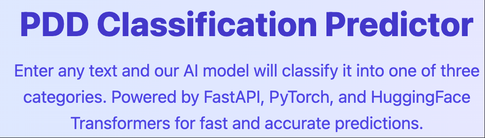
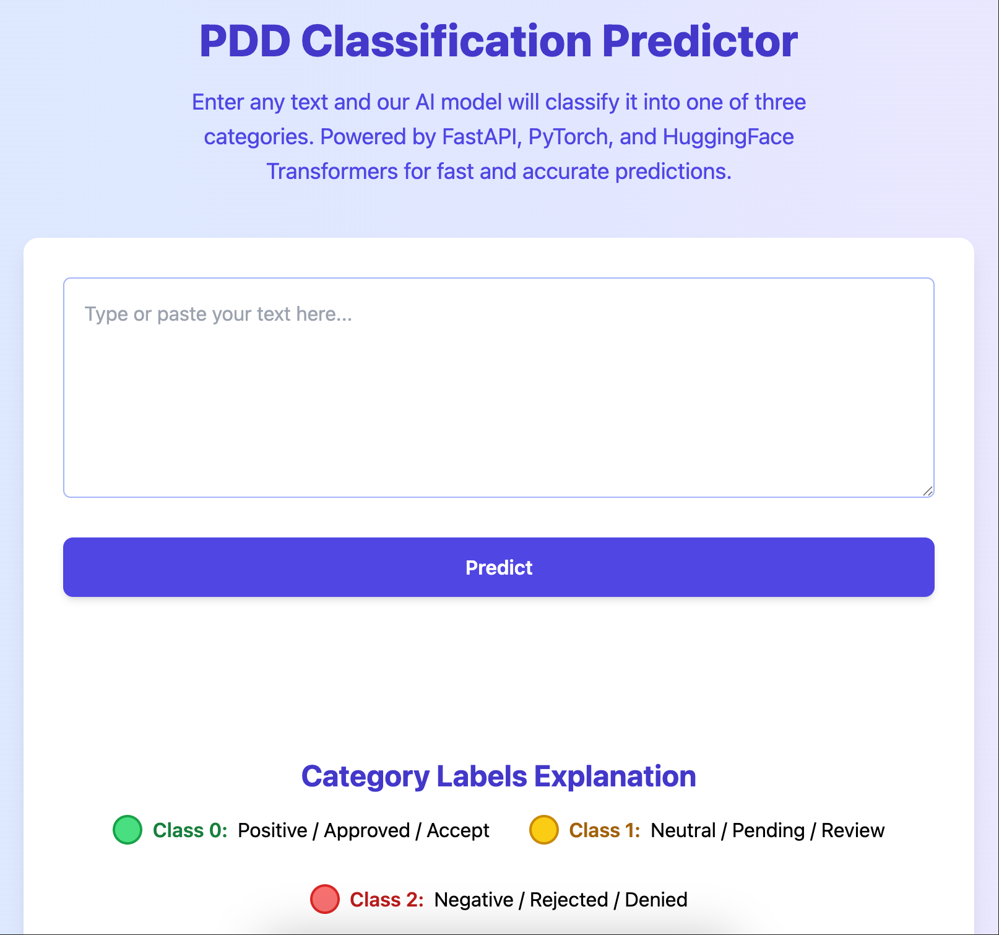

# NLP_PPD

  <!-- 如果有logo，放在docs或根目录 -->

**NLP_PPD** is an advanced NLP-based chatbot designed to assist healthcare professionals and users in the **early diagnosis of Postpartum Depression (PPD)**.  
Our system leverages cutting-edge deep learning models to analyze text inputs, offering accurate and timely insights to promote mental health awareness and intervention.

---

## 🚀 Features

- 🤖 **Intelligent Chatbot:** Engages users in natural language conversation to detect early signs of PPD.
- 📊 **Text Classification:** Uses a fusion of BERT and TF-IDF features to classify user input into multiple depression risk categories.
- ⚡ **Fast & Accurate:** Optimized transformer-based model runs efficiently on CPU/GPU.
- 📱 **User-friendly Interface:** Responsive and modern web UI for easy interaction.
- 🔄 **Extensible:** Easily adaptable for other mental health diagnostic tasks.

---

## 🛠️ Technology Stack

| Component           | Description                              |
|---------------------|------------------------------------------|
| **FastAPI**         | Backend REST API framework                |
| **PyTorch**         | Deep learning framework                   |
| **Transformers**    | Pretrained language models (RoBERTa)     |
| **Scikit-learn**    | TF-IDF vectorization                      |
| **Jinja2**          | Server-side HTML templating               |
| **TailwindCSS**     | Modern frontend styling                   |

---

## 🎯 How It Works

1. **Input:** User enters text describing feelings or experiences after childbirth.
2. **Processing:** Text is tokenized and vectorized (BERT + TF-IDF).
3. **Prediction:** Fusion model predicts PPD risk level (e.g., Low, Moderate, High).
4. **Output:** User receives intuitive feedback and suggestions via the chatbot interface.

---

## 📸 Demo Screenshot

  <!-- 你的页面截图放这里 -->

---

## ⚙️ Getting Started

### Prerequisites

- Python 3.8+
- Git
- Virtual environment tool (venv or conda)

### Installation

```bash
git clone https://github.com/yujieli65/PPD_text_classification.git
cd PPD_text_classification
python -m venv venv
source venv/bin/activate  # macOS/Linux
venv\Scripts\activate     # Windows
pip install -r requirements.txt
